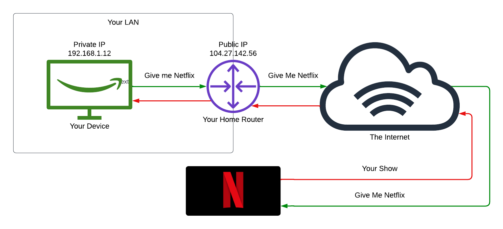

# Networking Basics

This guide covers foundational networking concepts, including LAN vs. WAN, private and public IP addresses, and a practical example of how you might stream Netflix from your laptop.

## LAN vs. WAN

Networking is all about connecting devices to share resources and information. Two fundamental types of networks are **LAN** (Local Area Network) and **WAN** (Wide Area Network).

### Local Area Network (LAN)
- **Definition**: A LAN is a network that connects devices within a small, localized area, like a home, office, or school.
- **Characteristics**:
  - High-speed connections (e.g., Ethernet or Wi-Fi).
  - Typically managed by a single entity (e.g., you or your IT department).
  - Limited geographic scope (e.g., a single building).
- **Example**: Your home Wi-Fi network connecting your laptop, phone, and smart TV.

### Wide Area Network (WAN)
- **Definition**: A WAN spans a large geographic area, connecting multiple LANs across cities, countries, or even continents.
- **Characteristics**:
  - Slower speeds compared to LANs due to distance and infrastructure.
  - Often relies on third-party providers (e.g., ISPs like Comcast or AT&T).
  - Covers a broad area (e.g., the internet itself is a WAN).
- **Example**: The connection between your home network and Netflix’s servers in another state or country.

---

## Private vs. Public IP Addresses

Every device on a network needs an **IP address** (Internet Protocol address) to communicate. IP addresses come in two flavors: private and public.

### Private IP Addresses
- **Purpose**: Used within a LAN to identify devices locally.
- **Range** (IPv4 examples):
  - `10.0.0.0 - 10.255.255.255`
  - `172.16.0.0 - 172.31.255.255`
  - `192.168.0.0 - 192.168.255.255`
- **Key Points**:
  - Not routable on the public internet (kept internal to your network).
  - Assigned by your router using protocols like DHCP.
  - Reusable across different private networks (e.g., your neighbor’s `192.168.1.2` won’t conflict with yours).
- **Example**: Your laptop might have an IP like `192.168.1.10` on your home Wi-Fi.

### Public IP Addresses
- **Purpose**: Used to identify devices or networks on the public internet.
- **Range**: Any IP not reserved for private use (managed by organizations like IANA).
- **Key Points**:
  - Unique across the entire internet.
  - Assigned by your Internet Service Provider (ISP).
  - Required for communication outside your LAN (e.g., accessing websites).
- **Example**: Your router might have a public IP like `73.45.12.108`.

### How They Work Together
Your router acts as a gateway between your private LAN and the public WAN. It uses **NAT** (Network Address Translation) to map your private IPs to its public IP when you connect to the internet.

---

## Example: Streaming Netflix from Your Laptop

Let’s walk through what happens when you watch Netflix on your laptop at home.

1. **Your Laptop (LAN)**:
   - IP: `192.168.1.10` (private).
   - You open Netflix in your browser and hit play on a show.

2. **Your Router**:
   - Private IP: `192.168.1.1` (inside your LAN).
   - Public IP: `73.45.12.108` (assigned by your ISP).
   - Your request goes from your laptop to the router, which uses NAT to send it out with the public IP.

3. **Internet (WAN)**:
   - Your request travels across the WAN (the internet) via your ISP, through various networks, to Netflix’s servers.
   - Netflix’s server (e.g., public IP `52.94.225.123`) receives the request.

4. **Netflix Responds**:
   - The server sends the video data back to your router’s public IP (`73.45.12.108`).
   - Your router translates it back to your laptop’s private IP (`192.168.1.10`) and delivers the stream.

5. **You Watch**:
   - The video plays on your laptop, all thanks to the seamless interplay of LAN, WAN, and IP addressing!

---
